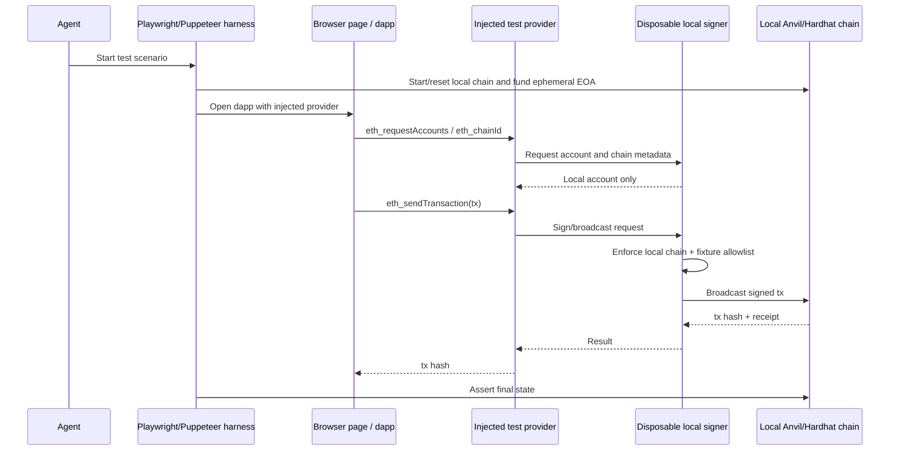
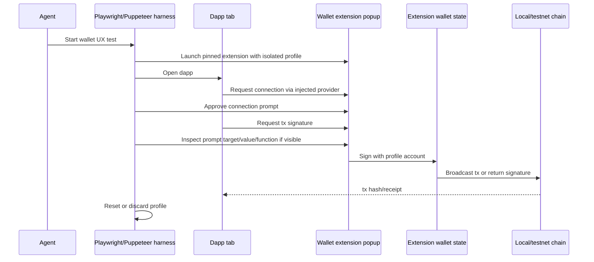
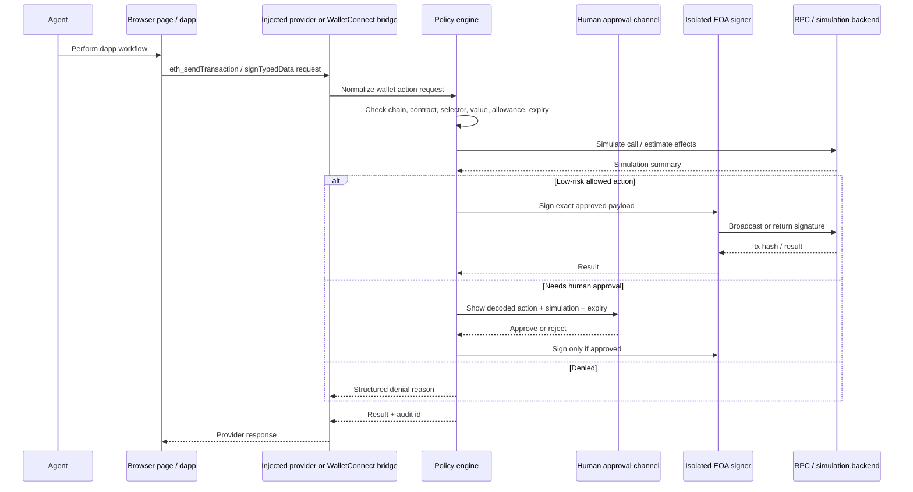

# Architecture notes

These notes define trust boundaries and request flows for the first three wallet-access pathways to evaluate. The common principle is that browser-control authority and signing authority should be separate except for disposable local/devnet keys.

## Common roles and trust boundaries

| Role | Owns | Must not own | Notes |
| --- | --- | --- | --- |
| Agent | Test objective, browser actions, assertions, proposed wallet intent | Valuable raw private keys, seed phrases, unbounded approval authority | Treat the agent as able to click hostile UI and read page content. |
| Browser page / dapp | Dapp UI, injected provider calls, transaction requests | Signing keys, approval policy, human approval channel | Treat page JavaScript as untrusted input to the signer. |
| Browser automation harness | Playwright/Puppeteer context, extension/profile lifecycle, local fixture setup | Long-lived funded keys | Can pass structured requests between page and signer but should log rather than decide high-risk actions. |
| Signer / wallet | EOA key or session key, signature creation, optional broadcast | Browser DOM authority | Should be small, deny-by-default, auditable, and isolated from arbitrary page code. |
| Policy / approval layer | Chain/contract/function/value rules, simulation decision, human escalation | Hidden signing side effects | Should evaluate the exact payload that will be signed or broadcast. |

## Pathway A — disposable local/devnet signer for CI/tests

### Intended use

Use this path for the first deterministic prototype: a local chain, an ephemeral funded EOA, a tiny dapp fixture, and a browser test that connects through an injected provider or test wallet adapter.

### Boundary decisions

- The EOA may be visible to the test harness only when the chain is local/devnet and state is recreated per run.
- The browser page receives an EIP-1193-compatible provider, not raw key material.
- The signer refuses non-local chain IDs and non-local RPC URLs even if the page requests them.
- Test assertions should verify both browser-visible success and onchain state, then reset chain state.

### Sequence

### Minimal implementation contract for later prototype

- Inputs: local RPC URL, allowed chain ID, funded ephemeral account index, dapp URL, allowed contract/function selectors.
- Outputs: tx hash, receipt status, final contract state assertion, audit record for each wallet request.
- Hard stop conditions: any public RPC URL, unknown chain ID, value above fixture cap, persistent seed/profile file.

## Pathway B — browser extension wallet automation profile

### Intended use

Use this path to measure real wallet compatibility after the local signer path works. It should test MetaMask/Rabby-style popup flows with an isolated low-value account and should not be treated as the primary safety boundary.

### Boundary decisions

- The browser profile is sensitive because the extension can sign; store it outside docs and regenerate/reset it when possible.
- The agent may click wallet UI only in local/testnet runs with low-value accounts.
- Extension version, network config, and selectors must be pinned or logged because popup automation is brittle.
- Public-network extension prompts require human approval outside the browser context controlled by the agent.

### Sequence

### Minimal implementation contract for later prototype

- Inputs: extension artifact/version, disposable browser profile path, local/testnet network config, dapp fixture URL, expected prompt text/selectors.
- Outputs: connection result, popup interaction transcript, tx hash/receipt, profile reset confirmation.
- Hard stop conditions: production seed phrase, persistent funded profile, unknown extension version, public-network value transfer without human approval.

## Pathway C — policy-gated signer service or WalletConnect bridge

### Intended use

Use this path for the second prototype once local browser-to-signer request flow is proven. The browser or WalletConnect session can ask for signatures, but a separate service owns the key and applies policy before signing or broadcasting.

### Boundary decisions

- The agent and browser can propose wallet actions; the signer service makes the allow/deny decision.
- Policy is deny-by-default and scoped to chain IDs, target contracts, function selectors, value caps, token allowance limits, session expiry, and optional human approval.
- Simulation and calldata decoding happen before signing; the audit log records the normalized request, policy decision, simulation summary, signer identity, and tx hash/signature result.
- WalletConnect is a transport option, not a safety model by itself; the policy service remains the safety boundary.

### Sequence

### Minimal implementation contract for later prototype

- Inputs: policy file, signer key source, chain RPC, request transport mode (`injected-provider` or `walletconnect`), approval timeout.
- Outputs: allow/deny decision, simulation summary, audit log entry, signature or tx hash only for approved requests.
- Hard stop conditions: missing policy, failed simulation on public/testnet, unknown contract/function, nonzero value above cap, unlimited token approval, expired session, opaque calldata requiring human approval.

## Related policy detail

- [Wallet-action policy model](policy-model.md) for concrete allowlists, caps, simulation, session expiry, audit fields, and human approval triggers.

## Recommended prototype ordering

1. Build docs and a local/devnet architecture first because it is deterministic, safe, and CI-friendly.
2. Add the policy-gated signer service next because it preserves signer isolation and introduces the controls needed for testnet/public workflows.
3. Evaluate extension wallet automation separately for compatibility coverage, not as the core custody model.
